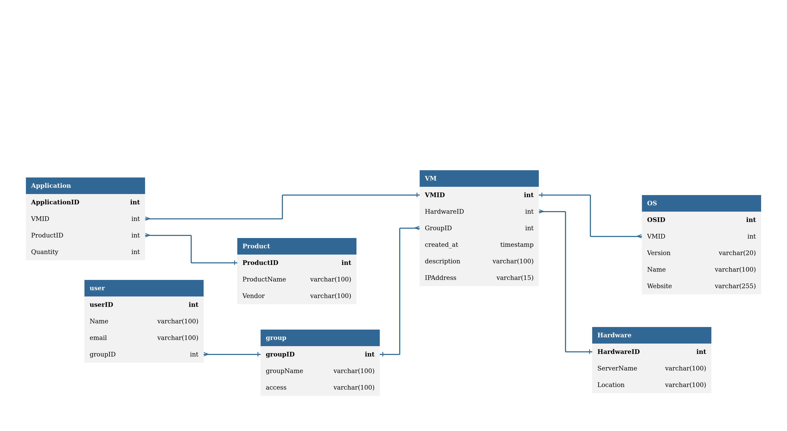

# ramluck-cloud
## DB Schema


## Mindmap


## Debug commands
### Databse
#### Connect to postgres in container
```bash
docker exec -it ramluckcloud-database psql -U postgres -d RamluckCloud
```
#### Show all tables
```sql
RamluckCloud=# \dt
```
#### Drop the Database
```sql
DROP TABLE IF EXISTS user_groups, users, groups, operating_systems, applications, vms, vm_applications CASCADE;
```

### API
#### Create new user
```bash
curl -X POST http://localhost:8088/api/login/register \
  -H "Content-Type: application/json" \
  -d '{
    "username": "newuser",
    "password": "securepassword123",
    "email": "newuser@example.cofm"
  }'
```
#### Get admin token
Get the admn token and saves it as env var:
```bash
ADMIN_TOKEN=$(curl -s -X POST http://localhost:8088/api/login \
  -H "Content-Type: application/json" \
  -d '{"username": "admin", "password": "admin"}' | jq -r '.token')
```
